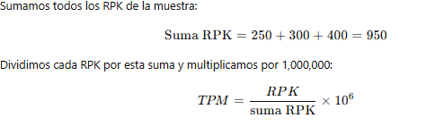
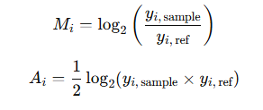
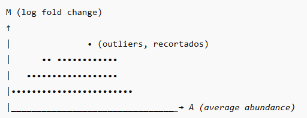
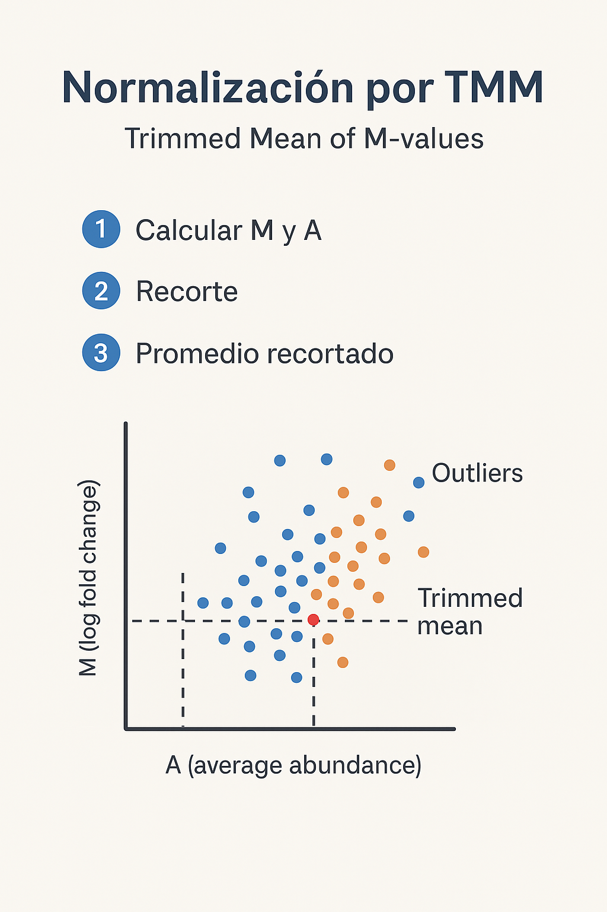
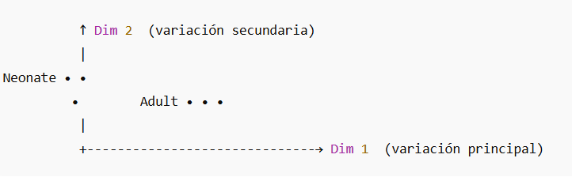

## Normalización por TPM:

**normalización por TPM** (Transcripts Per Million),una forma común de representar niveles de expresión génica en RNA-Seq, corrigiendo por la longitud del gen
y la profundidad total de secuenciación.

## Datos de ejemplo

Supongamos que tenemos tres genes con diferente longitud y número de lecturas asignadas:

| Gen | Longitud (kb) | Lecturas asignadas |
| --- | ------------- | ------------------ |
| A   | 2             | 500                |
| B   | 1             | 300                |
| C   | 0.5           | 200                |

## ⚙️ Paso 1: Calcular Reads Per Kilobase (RPK)

Corregimos por la longitud del gen:

RPK= lecturas / longitud del gen (kb)

## ⚖️ Calcular el factor de escala

## 📊Paso 3: Calcular los TPM

| Gen | RPK | TPM                         |
| --- | --- | --------------------------- |
| A   | 250 | (250 / 950) × 1e6 ≈ 263,158 |
| B   | 300 | (300 / 950) × 1e6 ≈ 315,789 |
| C   | 400 | (400 / 950) × 1e6 ≈ 421,053 |

## 📌 Interpretación:

El TPM representa la proporción relativa de expresión de cada gen dentro de la muestra.

Si sumas todos los TPM de una muestra, siempre obtendrás 1,000,000.

Esto permite comparar entre genes o entre muestras de diferente profundidad.

## edgeR

## 🧠 ¿Qué es la normalización por TMM?

La normalización por TMM (Trimmed Mean of M-values) corrige las diferencias en el tamaño de biblioteca y composición de expresión entre muestras de RNA-seq.
Su objetivo es garantizar que las comparaciones entre muestras reflejen diferencias biológicas reales, no técnicas.

📌 En otras palabras:

TMM ajusta las muestras para que los genes no diferenciales tengan, en promedio, el mismo nivel de expresión en todas ellas.

## ⚙️ ¿Por qué se necesita?

Imagina dos muestras:

| Muestra | Total de lecturas | Comentario           |
| ------- | ----------------- | -------------------- |
| Adulto  | 10 millones       | normal               |
| Neonato | 20 millones       | el doble de lecturas |

Si comparas directamente los conteos, todos los genes en Neonato parecerán “más expresados”,
cuando en realidad solo tiene más lecturas totales, no mayor expresión biológica.

La normalización TMM corrige eso ✅

## 🔬 Cómo funciona (conceptualmente)

1️⃣ Seleccionar una muestra de referencia

Se escoge una muestra base (por defecto, la primera).

Se comparan las demás muestras con esta referencia.

2️⃣ Calcular M y A para cada gen

M = log₂(ratio) de la abundancia entre la muestra y la referencia.

A = media log₂ del nivel de expresión.

3️⃣ Trimming (recorte)

Se eliminan genes con M o A extremos:

Genes muy poco expresados (ruidosos).

Genes con grandes diferencias (outliers).

Esto evita que pocos genes muy abundantes distorsionen la normalización.

4️⃣ Promedio recortado (Trimmed Mean)

Se calcula la media ponderada de los M-values restantes.

Este valor representa el factor de ajuste entre las dos muestras.

5️⃣ Factor de normalización (TMM factor)

Se transforma ese valor promedio en un factor multiplicativo (norm.factor),
que ajusta los tamaños de biblioteca (lib.size) en dge$samples

📊 Ejemplo visual (conceptual)

Imagina que cada punto es un gen:

➡️ El promedio de los puntos “centrales” (sin outliers) se usa para calcular el factor TMM.

Estos norm.factors se multiplican por los tamaños de biblioteca para obtener tamaños efectivos, usados internamente en el modelado de conteos y cálculo de CPM.

## 🔍 Diferencia entre TPM y TMM

| Característica | **TPM**                                            | **TMM**                                          |
| -------------- | -------------------------------------------------- | ------------------------------------------------ |
| Nivel de uso   | Normaliza expresión dentro de una muestra          | Normaliza entre muestras                         |
| Qué corrige    | Longitud del gen y profundidad total               | Profundidad total y composición de muestra       |
| Implementación | Directamente en cuantificadores (Salmon, Kallisto) | En análisis de conteos (edgeR)                   |
| Ideal para     | Comparar expresión relativa de genes               | Comparar expresión diferencial entre condiciones |

## En resumen

TMM ajusta las bibliotecas para que las diferencias observadas entre muestras reflejen biología, no técnica.

**Ventajas:**

- Robusta ante genes extremadamente expresados.

- Adecuada para conteos enteros (RNA-seq crudo).

- Es el método estándar en edgeR

## Multidimensional Scaling

Entender qué son las Dim 1 y Dim 2 en un gráfico MDS (Multidimensional Scaling) es clave para interpretar correctamente tus resultados de RNA-seq

🧠 Imagina esto:

Tienes 6 muestras (3 Adultos y 3 Neonatos),
y para cada una mediste la expresión de miles de genes (por ejemplo, 20.000).

Entonces… cada muestra no es solo un punto,
sino un vector de 20.000 dimensiones 😳
— una coordenada para cada gen.

👉 Pero no podemos graficar algo en 20.000 dimensiones, ¿verdad?
El MDS (Multidimensional Scaling) reduce esa complejidad a algo que sí podamos ver — dos dimensiones principales: Dim 1 y Dim 2.

🎯 Qué representan Dim 1 y Dim 2

| Dimensión | Qué significa                                                    | Qué muestra en el gráfico                                        |
| --------- | ---------------------------------------------------------------- | ---------------------------------------------------------------- |
| **Dim 1** | Es la **dirección con mayor variación** entre las muestras       | Diferencias **globales más grandes** (por ejemplo, entre grupos) |
| **Dim 2** | Es la **segunda dirección más variable**, independiente de Dim 1 | Diferencias **secundarias**, dentro o entre grupos               |

📊 Cómo leer tu gráfico

- Si los Adultos y Neonatos están separados a lo largo del eje Dim 1,
→ significa que esa es la principal diferencia biológica entre ellos.

- Si dentro de cada grupo hay ligera variación en Dim 2,
→ representa diferencias más pequeñas entre réplicas (por ejemplo, variabilidad individual).

- Las muestras del mismo color (grupo) se agrupan juntas.

- La distancia entre puntos representa qué tan diferentes son sus perfiles de expresión génica.

💡 En resumen:

Dim 1 y Dim 2 son los ejes que resumen las mayores diferencias en tus datos de expresión.
Son como las “direcciones principales” donde las muestras se separan según su perfil genético.

